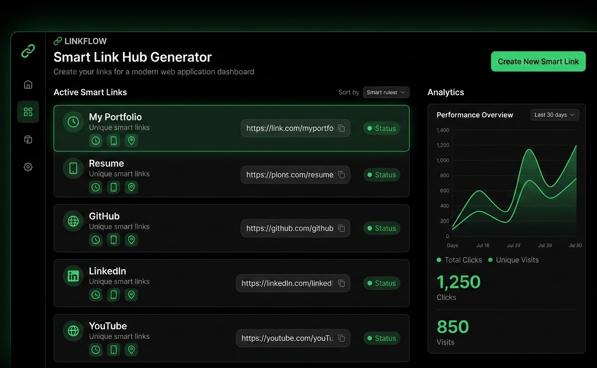
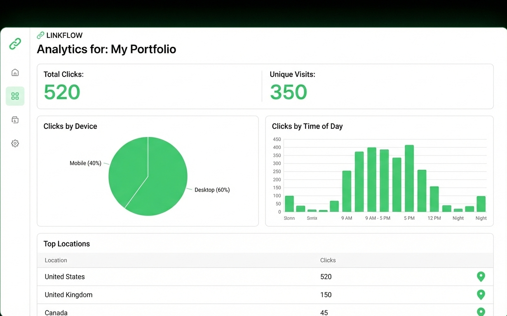
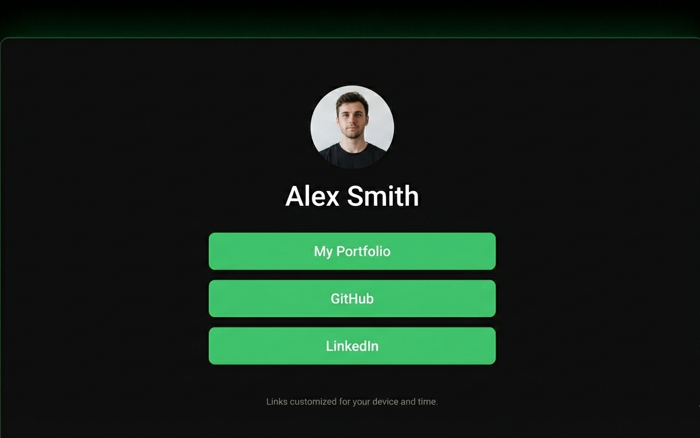
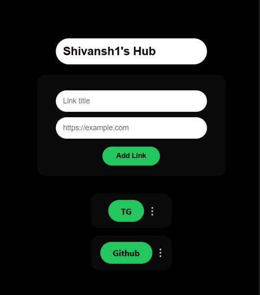
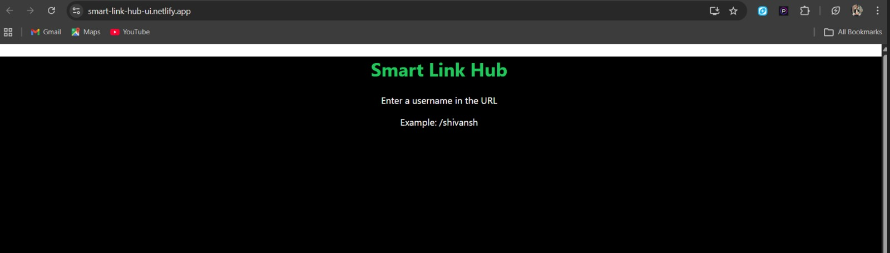

# 🔗 Smart Link Hub

Smart Link Hub is a full-stack web application that allows users to create a **personalized link-in-bio style hub**, where they can add, edit, and manage multiple links under a single username.

Built for hackathons and real-world usage with a clean UI, persistent backend storage, and live deployment.

---

## 🚀 Live Demo

- **Frontend (Netlify)**: https://smart-link-hub-ui.netlify.app  
- **Backend (Render)**: https://smart-link-hub-code-wale-1.onrender.com  

Example profile:
https://smart-link-hub-ui.netlify.app/shivansh


---

## 🎨 Visual Overview (Concept Design)

These concept images represent the design vision and planned user experience
of the Smart Link Hub, including smart rule configuration and analytics-driven
link prioritization.

### 🔗 Smart Link Hub Dashboard (Concept)


### ⚙️ Rule-Based Link Configuration (Concept)


### 📊 Analytics Dashboard (Concept)


### 🌐 Public Smart Link Page (Concept)


---

## 🖥️ Application Screenshots (Actual Implementation)

Below are real screenshots from the implemented Smart Link Hub application,
showing the working dashboard, link management, rule configuration, and analytics.

### Create Smart Link


### Public Smart Link 


---

## 🧠 Features

- 🔗 Create a personal link hub using a username
- ✏️ Add, edit, and delete links
- 👤 Owner vs Visitor mode
- 💾 Persistent data storage with MongoDB Atlas
- 🎨 Clean & modern UI with hover actions
- 🌐 Deployed frontend & backend
- ⚡ Fast and responsive

---

## 🛠 Tech Stack

### Frontend
- React (CRA)
- React Router
- Inline CSS styling
- Netlify (deployment)

### Backend
- Node.js
- Express.js
- MongoDB Atlas
- Mongoose
- Render (deployment)

---

## 📁 Project Structure

smart-link-hub-code-wale/
│
├── frontend/
│ ├── src/
│ ├── public/
│ └── package.json
│
├── backend/
│ ├── models/
│ ├── routes/
│ ├── server.js
│ └── package.json
│
└── README.md


---

## ⚙️ Environment Variables

### Backend (.env)

```env
PORT=5000
MONGO_URI=mongodb+srv://<username>:<password>@cluster.mongodb.net/smartlinkhub
⚠️ Do NOT commit .env files

▶️ Run Locally
Backend
cd backend
npm install
npm run dev
Frontend
cd frontend
npm install
npm start
Frontend runs on:

http://localhost:3000
Backend runs on:

http://localhost:5000
🧪 API Endpoints
Method	Endpoint	Description
GET	/api/hub/:username	Get user hub
POST	/api/hub	Create hub
PUT	/api/hub/:username	Update links
DELETE	/api/hub/:username/:linkId	Delete link
📊 Database
MongoDB Atlas

Collection: hubs

Stores:

username

title

links

visits

timestamps

🏆 Hackathon Ready
This project was built with:

Scalability

Clean UX

Real backend persistence

Production deployments

Perfect for demos & real usage.

👤 Author's
Code Wale
Hackathon Developers 🚀

GitHub: https://github.com/Shivanshraj1

⭐ Support
If you like this project, give it a ⭐ on GitHub!


---

## ✅ Step 2: Commit README

```bat
git add README.md
git commit -m "Add project README"
git push origin main
